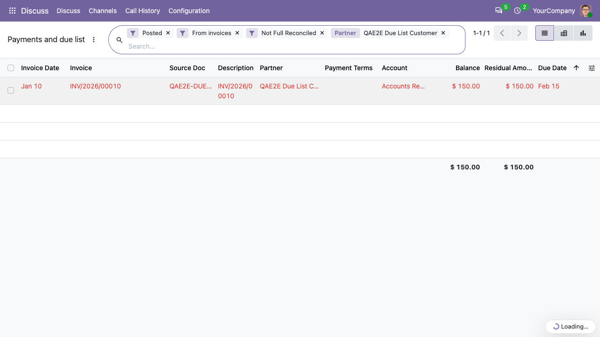

Go to *Invoicing > Accounting > Payments and due list*.

By default the list shows the posted, not fully reconciled lines of
reconcilable accounts coming from invoices, ordered by due date. Each line
shows the invoice, the source document, the partner, the payment terms, the
residual amount and the due date. Overdue lines are highlighted in red.

Use the search bar to filter by partner, invoice, source document or
salesperson, and the filters to split receivable and payable, overdue or
partially reconciled lines. The pivot and graph views group the residual
amount by due date.

