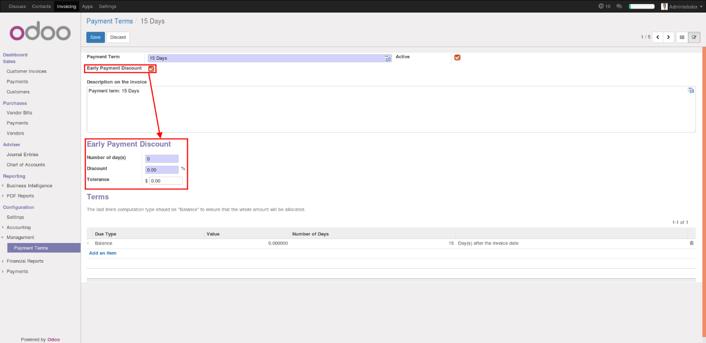

.. image:: https://img.shields.io/badge/licence-AGPL--3-blue.png
   :target: http://www.gnu.org/licenses/agpl-3.0-standalone.html
   :alt: License: AGPL-3

=====================================
Payment Term - Early Payment Discount
=====================================

This module adds **Early Payment Discount** information in Payment Term model.

Look at ``account_reconcile_rule_early_payment_discount`` module in https://github.com/OCA/account-reconcile
for using Early Payment Discount in reconciliation.

Configuration
=============

To configure Payment Term, user must have Adviser access in Accounting & Finance.

Go to Invoicing > Configuration > Management > Payment Terms

In the Payment Term form, you can check Early Payment Discount to display configurations fields.

.. image:: https://odoo-community.org/website/image/ir.attachment/5784_f2813bd/datas
   :alt: Try me on Runbot
   :target: https://runbot.odoo-community.org/runbot/96/11.0

Bug Tracker
===========

Bugs are tracked on `GitHub Issues
<https://github.com/OCA/account-payment/issues>`_. In case of trouble, please
check there if your issue has already been reported. If you spotted it first,
help us smashing it by providing a detailed and welcomed feedback.

Credits
=======

Contributors
------------

* Cyril Gaudin <cyril.gaudin@camptocamp.com>

Maintainer
----------

.. image:: https://odoo-community.org/logo.png
   :alt: Odoo Community Association
   :target: https://odoo-community.org

This module is maintained by the OCA.

OCA, or the Odoo Community Association, is a nonprofit organization whose
mission is to support the collaborative development of Odoo features and
promote its widespread use.

To contribute to this module, please visit https://odoo-community.org.
