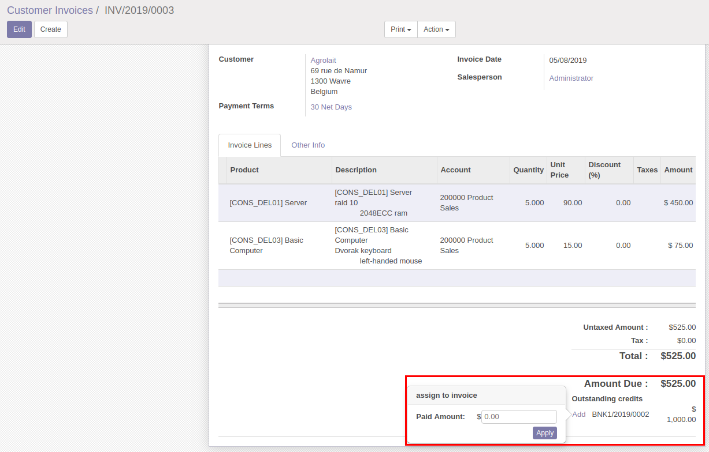
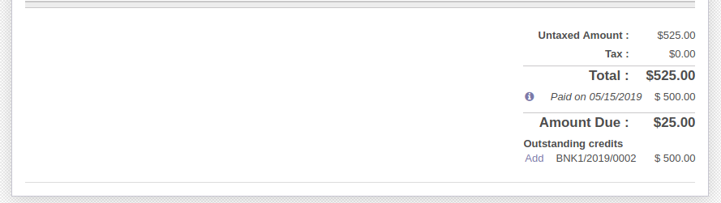

.. image:: https://img.shields.io/badge/licence-AGPL--3-blue.svg
   :target: http://www.gnu.org/licenses/agpl-3.0-standalone.html
   :alt: License: AGPL-3

=============================
Account Payment Widget Amount
=============================

This module adds a popover widget in the invoice form view when there
are outstanding payments that allows the user to select the amount
of the selected payment that wants to assign to the invoice.

Usage
=====

To use this module, you need to:

#. Go to 'Invoicing > Purchases > Vendor Bills' or to 'Invoicing > Sales >
   Customer Invoices'.
#. If there are payments registered you will see the Add option.
#. Press Add and enter the amount you want to add to invoice.
#. Automatic reconciliation will be done with the specified amount.

Bug Tracker
===========

Bugs are tracked on `GitHub Issues
<https://github.com/OCA/account-payment/issues>`_. In case of trouble, please
check there if your issue has already been reported. If you spotted it first,
help us smash it by providing detailed and welcomed feedback.

Credits
=======

Images
------

* Odoo Community Association: `Icon <https://github.com/OCA/maintainer-tools/blob/master/template/module/static/description/icon.svg>`_.

Contributors
------------

* Adrià Gil Sorribes <adria.gil@eficent.com>
* Jordi Ballester Alomar <jordi.ballester@eficent.com>

Maintainer
----------

.. image:: https://odoo-community.org/logo.png
   :alt: Odoo Community Association
   :target: https://odoo-community.org

This module is maintained by the OCA.

OCA, or the Odoo Community Association, is a nonprofit organization whose
mission is to support the collaborative development of Odoo features and
promote its widespread use.

To contribute to this module, please visit https://odoo-community.org.
