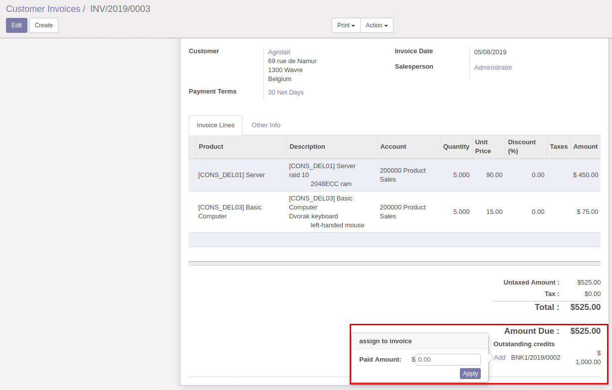

This module adds a popover widget in the invoice form view when there
are outstanding payments that allows the user to select the amount of
the selected payment that wants to assign to the invoice.

