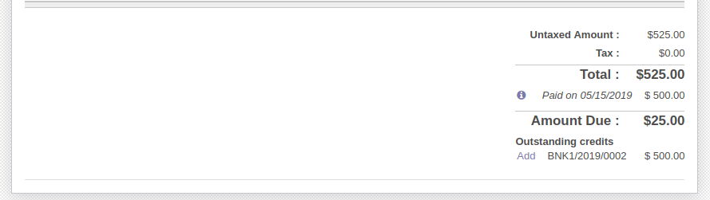

To use this module, you need to:

#. Go to 'Invoicing > Purchases > Vendor Bills' or to 'Invoicing > Sales >
   Customer Invoices'.
#. If there are payments registered you will see the Add option.
#. Press Add and enter the amount you want to add to invoice.
#. Automatic reconciliation will be done with the specified amount.

