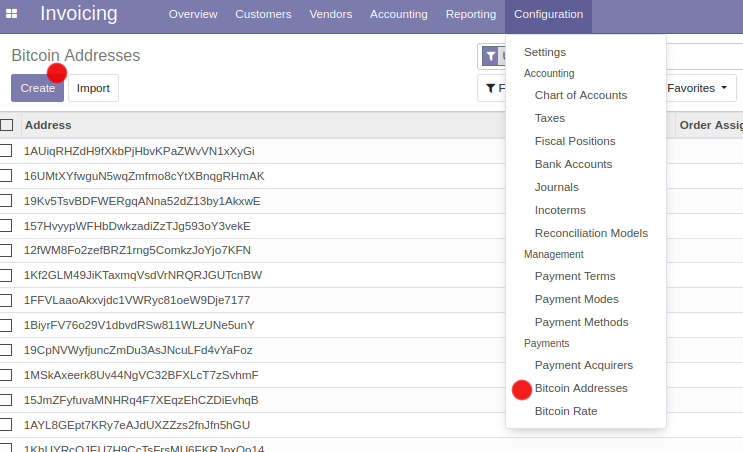
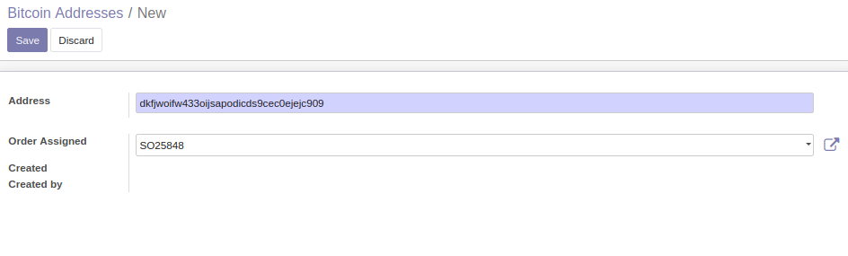

========================
Bitcoin Payment Acquirer
========================

.. !!!!!!!!!!!!!!!!!!!!!!!!!!!!!!!!!!!!!!!!!!!!!!!!!!!!
   !! This file is generated by oca-gen-addon-readme !!
   !! changes will be overwritten.                   !!
   !!!!!!!!!!!!!!!!!!!!!!!!!!!!!!!!!!!!!!!!!!!!!!!!!!!!

.. |badge1| image:: https://img.shields.io/badge/maturity-Beta-yellow.png
    :target: https://odoo-community.org/page/development-status
    :alt: Beta
.. |badge2| image:: https://img.shields.io/badge/licence-AGPL--3-blue.png
    :target: http://www.gnu.org/licenses/agpl-3.0-standalone.html
    :alt: License: AGPL-3
.. |badge3| image:: https://img.shields.io/badge/github-OCA%2Fodoo--modules-lightgray.png?logo=github
    :target: https://github.com/OCA/odoo-modules/tree/12.0/payment_bitcoin
    :alt: OCA/odoo-modules
.. |badge4| image:: https://img.shields.io/badge/weblate-Translate%20me-F47D42.png
    :target: https://translation.odoo-community.org/projects/odoo-modules-12-0/odoo-modules-12-0-payment_bitcoin
    :alt: Translate me on Weblate

|badge1| |badge2| |badge3| |badge4| 

This module lets ecommerce customers to pay with Bitcoin. During configuration, multiple Bitcoin addresses need to be entered. Each Bitcoin address is assigned to one order only and used only once. During checkout, when a customer chooses to pay with Bitcoin, the next available Bitcoin address will be assigned to the sales order and the amount to be paid in Bitcoin is calculated automatically. At the time of assigning a Bitcoin address, the current exchange rate is fetched from TODO and the configured Bitcoin rate is applied to it. This rate can be configured similarly to an additional payment fee. At the checkout confirmation page, the Bitcoin address and the amount to-be-payed is displayed to the customer. The amount and Bitcoin address can also be send to the customer in the order confirmation email. If a customer chooses to pay with Bitcoin but no Bitcoin address is available, an error is displayed.

Other than fetching the exchange rate, there is no online integration or Blockchain implementation to other services or the Bitcoin network. The actual Bitcoin Payments are not known to Odoo. Instead payments need to be confirmed manually, similarly to wire transfers.

In the backoffice a Bitcoin rate needs to be configured and several Bitcoin addresses to be entered.

Invoicing -> Configuration -> Bitcoin Adresses

When adding or importing Bitcoin addresses their validity is verified. The same Bitcoin address can't be added twice.

Bitcoin addresses are assigned to sales orders:

Invoicing -> Configuration -> Bitcoin Adresses -> Create

**Table of contents**

.. contents::
   :local:

Bug Tracker
===========

Bugs are tracked on `GitHub Issues <https://github.com/OCA/odoo-modules/issues>`_.
In case of trouble, please check there if your issue has already been reported.
If you spotted it first, help us smashing it by providing a detailed and welcomed
`feedback <https://github.com/OCA/odoo-modules/issues/new?body=module:%20payment_bitcoin%0Aversion:%2012.0%0A%0A**Steps%20to%20reproduce**%0A-%20...%0A%0A**Current%20behavior**%0A%0A**Expected%20behavior**>`_.

Do not contact contributors directly about support or help with technical issues.

Credits
=======

Authors
~~~~~~~

* Nitrokey GmbH

Maintainers
~~~~~~~~~~~

This module is maintained by the OCA.

.. image:: https://odoo-community.org/logo.png
   :alt: Odoo Community Association
   :target: https://odoo-community.org

OCA, or the Odoo Community Association, is a nonprofit organization whose
mission is to support the collaborative development of Odoo features and
promote its widespread use.

This module is part of the `OCA/odoo-modules <https://github.com/OCA/odoo-modules/tree/12.0/payment_bitcoin>`_ project on GitHub.

You are welcome to contribute. To learn how please visit https://odoo-community.org/page/Contribute.
