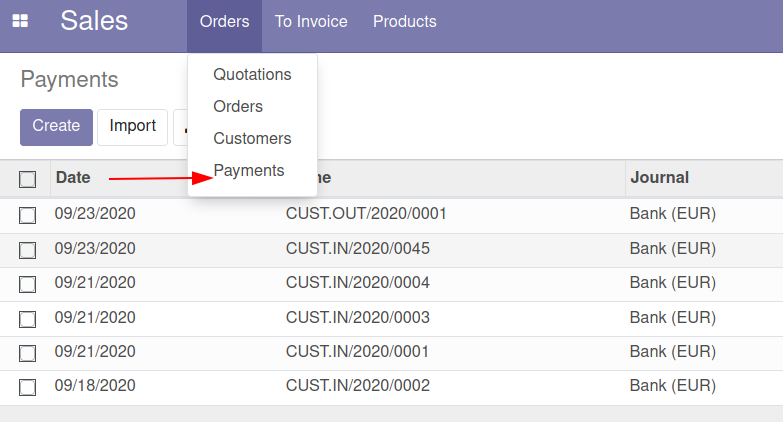

This addon adds a Payments (only customer payments) menu in Sales to users that belong to any of these Sales groups:

* Sales / User: Own Documents Only
* Sales / User: All Documents
* Sales / Administrator

Show "Register payment" button in invoices (that allows a more faster creation and validation of related payments) to users in some of these above groups

Hide 'Vendor' option in Partner type about create payments if user not in Invoicing group

If users are in group "Sales / User: Own Documents Only", they can only view their payments (created by themselves).
